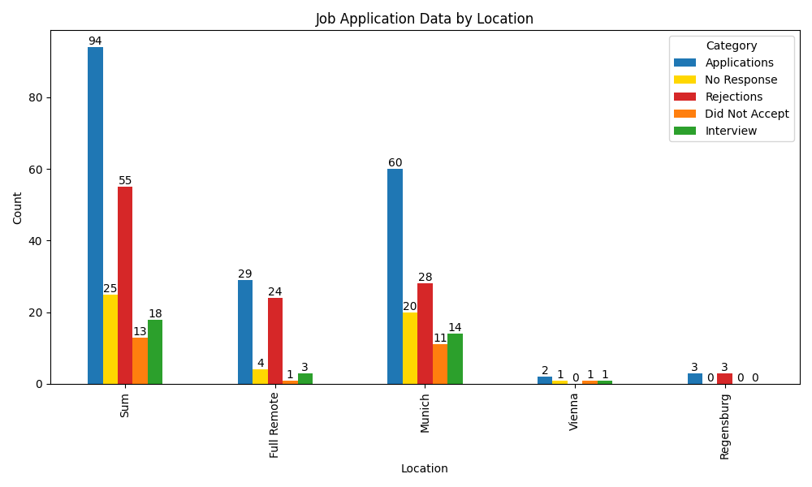
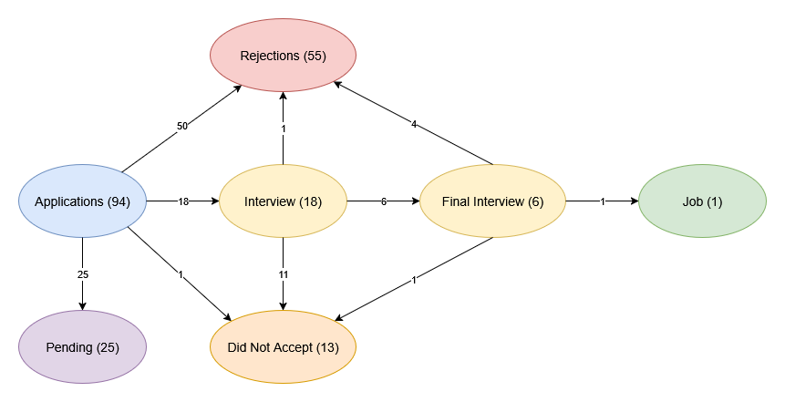

# joblytics

## Setup
```
python3 -m venv venv
source venv/bin/activate
pip install -r requirements.txt
```

## Run
```
python3 main.py
```

## Results

### Key Numbers:

* **94 applications** in total
* **25 no response yet**
* **18 interviews** → **6 final interviews**
* **55 Rejections:** 50 directly, 1 after interview, 4 after final interview
* **13 jobs that i did not accept** (9 after I got my job, 4 earlier because it wasn’t a fit)
* **1 job accepted**

### Why I rejected 4 jobs:

* Only 1 day home office allowed, zero flexibility
* Military clients
* Job in Vienna, but my girlfriend got a job in Germany, so I had to drop it





